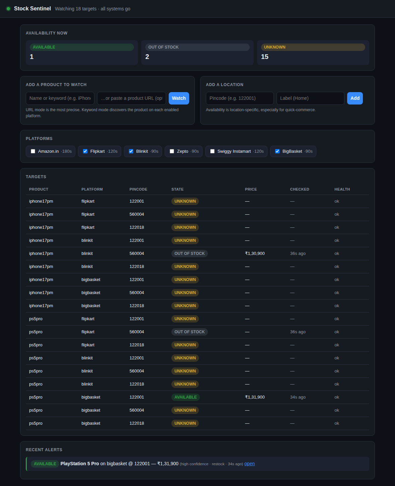

# Stock Sentinel

Reliable, local-first **product availability monitoring** for Indian e-commerce
and quick-commerce platforms. Stock Sentinel watches the products you want to
buy across Amazon, Flipkart, Blinkit, Zepto, Swiggy Instamart, and BigBasket,
at the pincodes you care about, and alerts you the moment something becomes
purchasable — without crying wolf.

> **A false "in stock" alert is the worst thing this app can do.** Every design
> decision — nine distinct availability states, evidence-based verdicts,
> confirmation re-checks, edge-triggered deduplication — exists to keep false
> positives at zero while still catching real restocks fast.



## What makes it different

- **Nine availability states, never collapsed** — `AVAILABLE`, `OUT_OF_STOCK`,
  `UNAVAILABLE_IN_AREA`, `COMING_SOON`, `PREORDER`, `TEMPORARILY_UNAVAILABLE`,
  `NOT_LISTED`, `UNKNOWN`, `ERROR`. An ambiguous page is `UNKNOWN`, never a
  guess.
- **False-positive defence in depth** — coherent evidence → confidence gate →
  state-machine hysteresis → confirmation re-check → dedup ledger. All five must
  pass before an AVAILABLE alert fires.
- **Discovery-driven, not assumption-driven** — every platform was studied
  first (see [`docs/discovery/`](docs/discovery)) and each adapter's detection
  is grounded in that evidence (e.g. BigBasket's `avail_status == "001"`,
  Swiggy's WAF-stub → `UNKNOWN`).
- **Built to run for weeks** — crash-only design, SQLite WAL persistence,
  automatic recovery from outages/restarts, bounded memory, per-platform
  politeness (serialised requests, jitter, exponential back-off).
- **Respectful by construction** — guest mode, human cadence, no CAPTCHA
  solving or evasion; it only watches what you explicitly ask it to, for
  personal purchasing use.

## Two ways to run

Stock Sentinel is primarily a **desktop app** (Electron), but ships a
**headless web-UI mode** that runs the identical engine and serves the same
dashboard over HTTP — ideal for servers, containers, or remote sessions.

```bash
npm install

# Headless web UI (auto-selects a free port from 4173 up; or set PORT)
npm run serve
#   🟢 Stock Sentinel is running
#      URL:  http://127.0.0.1:4173

# Desktop app (requires the optional electron dependency)
npm start

# End-to-end scenario demo (no network, prints a narrated timeline)
npm run demo

# Tests / typecheck
npm test
npm run typecheck
```

The `serve` and `demo` modes use a built-in **simulated runtime** so they run
anywhere with zero network access; the desktop build wires the real
Playwright-based runtime.

## How it works (one paragraph)

A central **scheduler** picks due targets (`product × platform × pincode`),
respecting one in-flight request per platform, jitter, and back-off. Each
platform **adapter** fetches content through an `AdapterRuntime` (real browser
in production, fixtures/simulation in tests) and a **pure signal extractor**
turns it into evidence. The **confidence model** maps evidence to one of nine
states; the **state machine** decides whether a transition occurred, whether
it's alert-worthy, and whether an AVAILABLE reading needs a confirmation
re-check. Alert-worthy edges go through the **alert pipeline** (validate →
dedup ledger → dispatch to desktop/sound/email/WhatsApp, each isolated and
retried). Everything persists to **SQLite** so a restart just resumes.

## Repository layout

```
docs/                 Full design set (see below)
  discovery/          Phase-2 platform discovery reports (evidence-grounded)
src/core/             Pure engine: types, state machine, scheduler, rate limiter,
                      circuit breaker, confidence model, dedup, engine loop
src/adapters/         6 platform adapters + pure signal extractors + runtimes
src/alerts/           Dispatcher + desktop/sound/email/whatsapp channels
src/infra/            SQLite + JSON storage, logger, net probe, system clock
src/session/          Session manager (guest/auth, expiry, re-login)
src/app/              Target materialisation + MonitoringService (wiring)
src/server/           Headless web UI (dashboard + JSON API + port finder)
src/main/             Electron desktop shell
scripts/              demo.ts (scenario) · serve.ts (web UI)
tests/                142 tests: unit, contract, adapter, recovery, soak, server
```

## Documentation

| Doc | Contents |
|-----|----------|
| [Requirements](docs/01-requirements.md) | Functional/non-functional requirements, 9-state model, acceptance criteria |
| [Architecture](docs/02-architecture.md) | Components, data flow, state/lifecycle/sequence diagrams, storage schema |
| [Discovery reports](docs/discovery/README.md) | Per-platform behaviour + chosen monitoring strategy (evidence-grounded) |
| [UX design](docs/04-ux-design.md) | Wireframes, flows, screen definitions, interaction specs |
| [Risk & failure analysis](docs/05-risk-failure-analysis.md) | Risk register, failure-recovery matrix, false-positive defence |
| [Test strategy](docs/06-test-strategy.md) | Layers, key cases, infrastructure, gates |
| [Roadmap](docs/07-roadmap.md) | Milestones and delivery status |
| [User guide](docs/08-user-guide.md) | Install, first run, everyday use, alerts, troubleshooting |
| [Maintenance](docs/09-maintenance.md) | Keeping adapters working, diagnostics, retention, upgrades |
| [Platform integration guide](docs/10-platform-integration-guide.md) | Adding platform #7 step by step |

## Responsible use

Stock Sentinel performs low-volume, personal-use reads of pages you could open
yourself, identifies as a normal browser session, honours back-off signals, and
never automates checkout or credential entry. Automated access may still be
contrary to a platform's terms; you are responsible for your own use. See
Help → Responsible Use in the app.

## License

MIT.
