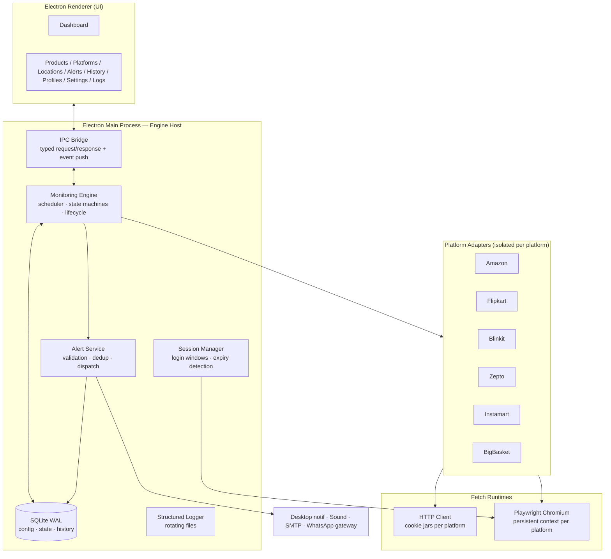
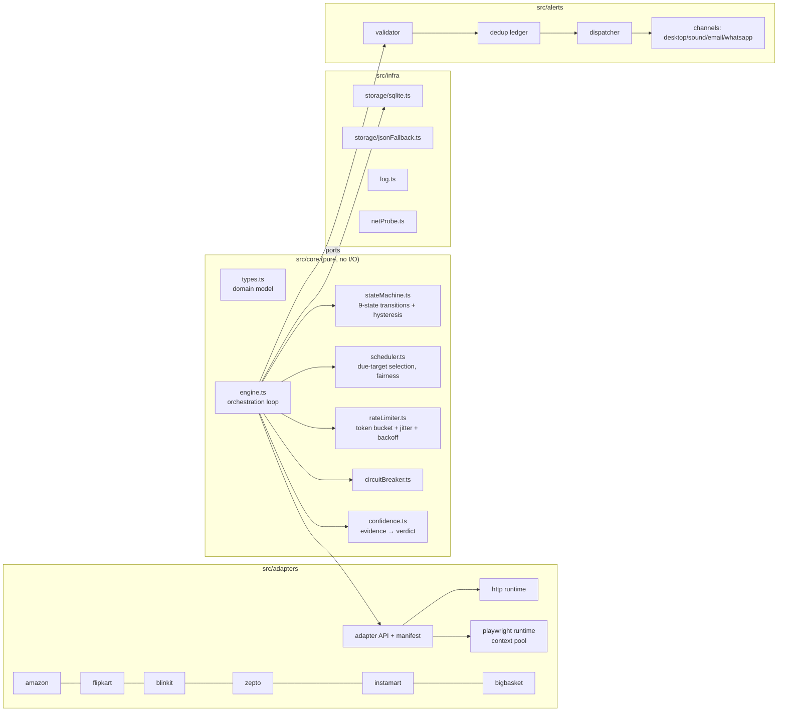
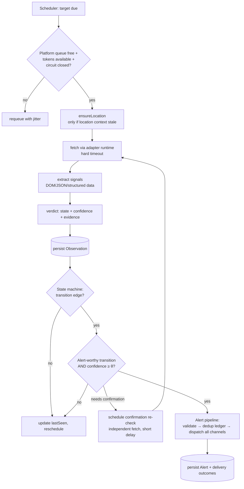
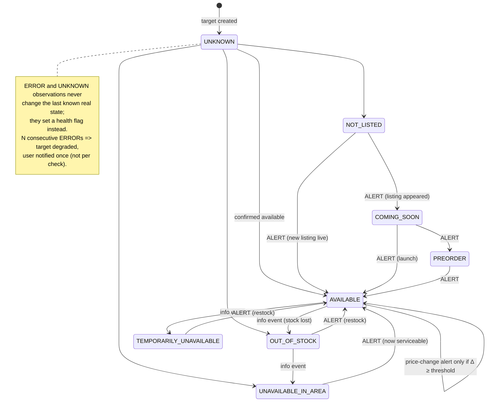
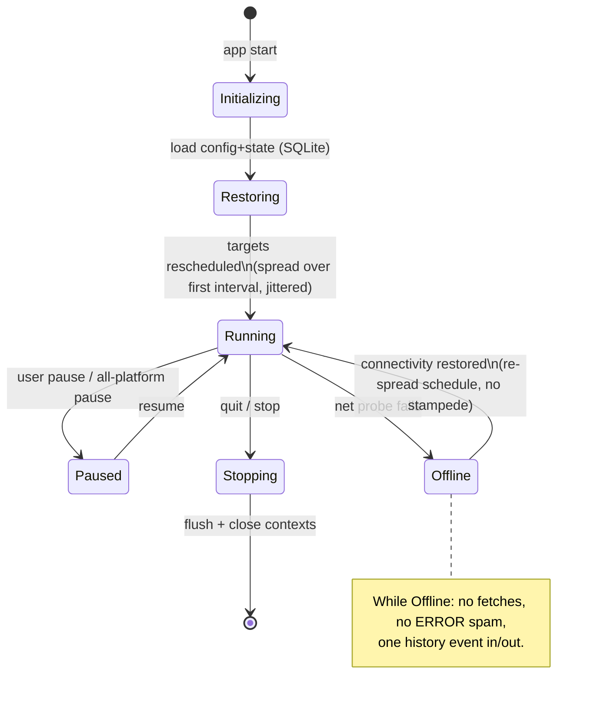
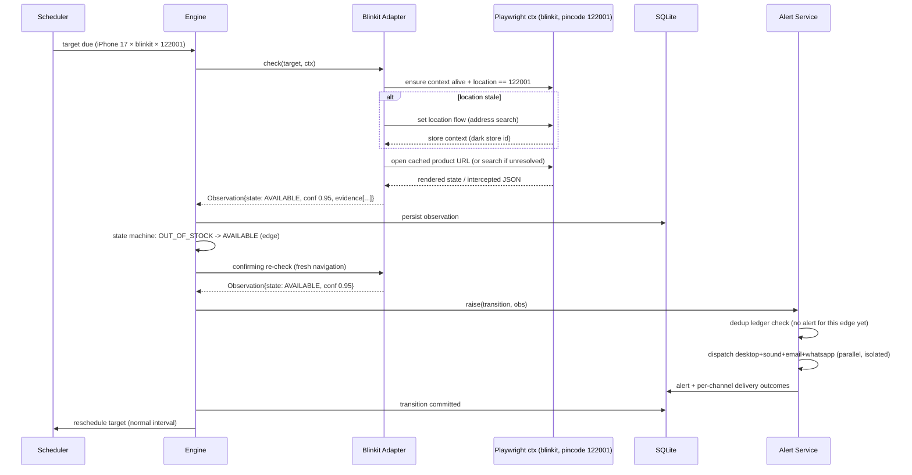
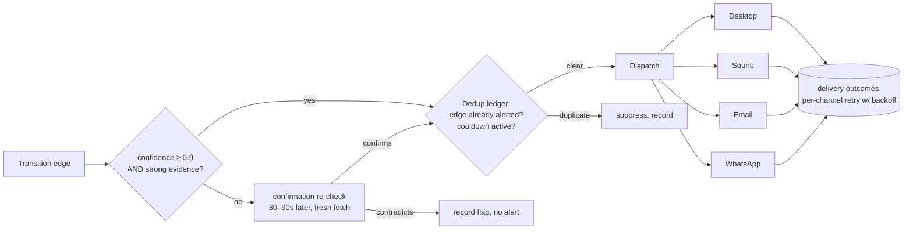
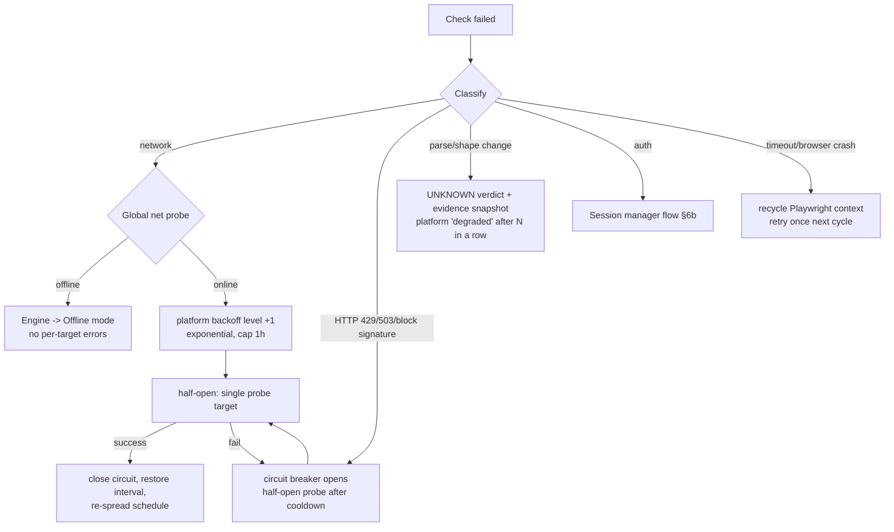

# Stock Sentinel — Architecture Design

**Document status:** Approved baseline (v1.0)

---

## 1. Architecture overview

Stock Sentinel is a **local-first desktop application** built as an Electron
shell around a Node.js/TypeScript monitoring engine, with Playwright-driven
persistent browser contexts for platforms that require a real browser, and
SQLite for all persistence.



### 1.1 Key decisions and alternatives considered

| Decision | Chosen | Alternatives | Rationale |
|---|---|---|---|
| App shell | **Electron + TypeScript** | Tauri, Python+Qt, local web app + tray daemon | One language end-to-end (engine, adapters, UI); first-class Playwright and SQLite support; mature notification/tray/auto-launch APIs; non-technical-user installers (dmg/exe). Tauri would need a Rust core or sidecar for Playwright; Python+Qt packaging for non-technical users is weaker. Electron's RAM cost is acceptable given we run headless Chromium anyway. |
| Engine location | **Electron main process** | Separate daemon process | Simpler v1 lifecycle; engine is a pure library (`src/core`) with no Electron imports, so extracting it into a standalone daemon later is a packaging change, not a rewrite. |
| Fetch strategy | **Playwright persistent context is the primary runtime for every platform; a plain-HTTP fetch path is retained per-adapter only as a degraded fallback.** Discovery (docs/discovery/) showed all six need a real browser for reliability: Amazon's anti-bot returns 503/CAPTCHA to naive HTTP; Flipkart renders stock via JS and obfuscates/rotates CSS classes; Blinkit/Zepto/Instamart are SPAs with edge protection; BigBasket is a heavy SPA. | All-HTTP; mixed HTTP-first | All-HTTP fails on SPAs and gets blocked on Amazon/Flipkart, i.e. exactly the false-negatives/positives we must avoid. The adapter interface hides the runtime; the quick-commerce adapters use a **Playwright-bootstrap → internal-JSON-poll hybrid** (browser establishes location/store context + cookies, then the internal search API is polled through that context for a deterministic `inventory`/`outOfStock` truth signal), while Amazon/Flipkart render and read the product page directly. Cost (one Chromium, contexts pooled/recycled per platform×location, serialized) is acceptable and bounded by NFR-3. |
| Persistence | **SQLite (WAL)** | JSON files, LevelDB, Postgres | Crash-safe, queryable history (search/filter/export/retention), single file backup. JSON files can't support history queries at scale; Postgres is absurd for a desktop app. Native-module risk is mitigated by a storage interface with a JSON fallback driver used in tests. |
| Scheduling | **Central scheduler + per-platform serialized work queues with token-bucket rate limits and jitter** | Per-target timers, cron | Per-target timers stampede after wake-from-sleep; a central scheduler can enforce per-platform politeness (one in-flight request per platform), fairness, and coordinated back-off. |
| Availability decisions | **Evidence-based signal extraction → rule table per platform → 9-state verdict with confidence score** | Boolean in-stock parsing | Required by product; also the foundation of false-positive control (an alert needs both a state transition *and* confidence ≥ threshold, else confirmation re-check). |
| Alert dedup | **Persisted per-target state machine; alerts only on transition edges** | Time-window dedup | Time windows still re-alert on flapping; edge-triggered transitions with hysteresis (confirmation) are exact. |
| Session storage | **Playwright persistent context dirs per platform (+ serialized cookie jar for HTTP adapters)** | Extracting cookies into DB | Letting Chromium own its profile is the only robust way to keep localStorage/IndexedDB-based sessions (quick-commerce SPAs) alive; the DB stores only metadata (login state, last validated). |

### 1.2 Design principles applied

- **Hexagonal core.** `src/core` knows nothing about Electron, Playwright, or
  any platform. Ports: `PlatformAdapter`, `AlertChannel`, `Storage`, `Clock`,
  `NetworkProbe`. Everything else is an adapter. This is what makes the test
  strategy (deterministic engine tests with fake clock + scripted adapters)
  and future platform additions cheap.
- **Bulkheads.** Each platform runs in its own queue with its own circuit
  breaker; an exception, block, or hang (checks carry hard timeouts) in one
  platform cannot starve another.
- **Crash-only design.** The engine persists intent (targets + their schedule
  state) and results (observations/transitions) transactionally; recovery is
  simply "load and continue" — there is no special crash-recovery path to keep
  correct, restart *is* the recovery path.
- **Never guess.** Signal extraction produces evidence; the rule table maps
  evidence to a state only when the evidence is coherent. Anything else is
  `UNKNOWN` with the raw evidence stored for diagnosis.

---

## 2. Component architecture



### 2.1 The adapter contract

```ts
interface PlatformAdapter {
  readonly manifest: PlatformManifest;      // id, name, runtime, politeness defaults,
                                            // location strategy, auth capabilities
  /** Resolve a keyword to candidate products at a location (search). */
  search(q: SearchQuery, ctx: CheckContext): Promise<CandidateProduct[]>;
  /** Read availability for a resolved product/URL at a location. */
  check(target: ResolvedTarget, ctx: CheckContext): Promise<Observation>;
  /** Cheap probe used by session manager: is our session/location still valid? */
  probeSession(ctx: CheckContext): Promise<SessionProbe>;
  /** Apply/refresh a location on the underlying session (may be a no-op). */
  ensureLocation(pincode: string, ctx: CheckContext): Promise<LocationResult>;
}
```

`Observation` never contains a bare boolean. It contains:
`{ state: AvailabilityState, price?: Money, evidence: Signal[], confidence: 0..1, fetchedVia, url, at }`.

### 2.2 Monitor target model

```
Product (1) ──< ProductPlatformBinding (optional per-platform URL/ASIN/pid)
Profile  ──< selects >── Products, Platforms, Locations, AlertPolicy
Target = (productId, platformId, pincode)   // materialized, has:
   schedule state (nextDueAt, interval, backoffLevel)
   machine state (currentState, sinceAt, lastConfirmedAt, flapCount)
   resolution cache (resolved URL/productRef per platform+location)
```

---

## 3. Data flow



Key property: **the confirmation re-check re-enters the same pipeline** — it is
a normal fetch with a `confirming` flag, so it obeys the same politeness rules
and produces the same evidence records.

---

## 4. Availability state machine



Transition rules of note:

1. **Hysteresis into AVAILABLE.** Entering AVAILABLE from any non-available
   state requires either confidence ≥ 0.9 with strong evidence (e.g. buy-box +
   structured-data agreement) or two consecutive AVAILABLE observations
   (the confirmation re-check). This is the false-positive gate.
2. **ERROR/UNKNOWN are overlays, not states of the world.** They are recorded
   and surfaced as target health, but the "last known commercial state" is kept
   so that recovery does not generate a spurious "reappeared" alert.
3. **Flap damping.** If a target alternates AVAILABLE/OUT_OF_STOCK more than K
   times in an hour, alerts collapse into a single "volatile stock" alert with
   a cooldown.

---

## 5. Monitoring lifecycle



Per-target pause/resume simply toggles participation in the scheduler; state
machine state is preserved.

---

## 6. Sequence: keyword monitoring on a browser-runtime platform



## 6b. Sequence: session expiry & re-auth

```mermaid
sequenceDiagram
    participant E as Engine
    participant A as Adapter
    participant SM as Session Manager
    participant U as User (UI)

    E->>A: check(target)
    A-->>E: Observation{state: ERROR, evidence:[LOGIN_WALL]}
    E->>SM: reportAuthFailure(platform)
    SM->>SM: probeSession() to confirm (not a one-off)
    SM->>U: notify once: "Zepto session expired" + [Re-login] action
    SM->>E: platform mode -> guest-if-possible else suspended
    U->>SM: clicks Re-login
    SM->>SM: open visible browser window on platform login page
    U->>SM: completes OTP login (app never touches credentials)
    SM->>SM: probeSession() green
    SM->>E: platform mode -> authenticated; resume targets
```

---

## 7. Alert pipeline (validation, dedup, dispatch)



The **dedup ledger** is persisted: key = (targetId, edgeType, stateEnteredAt).
A restart cannot re-fire an alert for an edge that was already dispatched,
because dispatch is recorded in the same transaction that commits the
transition.

Confidence model: each extracted signal carries a weight (structured data
`InStock` = strong; visible "Add to cart" enabled = strong; price present =
supporting; text heuristic match = weak). Verdict confidence is computed from
signal agreement; disagreement caps confidence at 0.5 → `UNKNOWN` unless a
platform rule resolves it.

---

## 8. Failure recovery workflow



The full failure matrix (cause → detection → response → user visibility) lives
in `docs/05-risk-failure-analysis.md`.

---

## 9. Storage schema (SQLite)

```
products(id, name, mode, keywords_json, rules_json, group_name, enabled, created_at, ...)
product_bindings(product_id, platform_id, url, platform_ref, resolved_by, resolved_at)
locations(pincode PK, label, enabled)
platforms(id PK, enabled, settings_json, session_state, session_checked_at)
profiles(id, name, payload_json, active)
targets(id, product_id, platform_id, pincode, enabled, interval_s, next_due_at,
        backoff_level, state, state_since, last_confirmed_at, flap_count, health)
observations(id, target_id, at, state, confidence, price_minor, currency,
             url, fetched_via, evidence_json)          -- pruned by retention
transitions(id, target_id, at, from_state, to_state, observation_id, alerted)
alerts(id, transition_id, at, payload_json, confidence)
alert_deliveries(alert_id, channel, status, attempts, last_error, delivered_at)
events(id, at, kind, level, source, message, data_json)  -- lifecycle/errors/audit
settings(key PK, value_json)
```

WAL mode, `synchronous=NORMAL`, single writer (engine), foreign keys ON.
Retention job runs daily: prune observations > N days (archiving to
`archive/observations-YYYY-MM.jsonl.gz` first), keep transitions/alerts 1 year.

---

## 10. Politeness & human-like operation (engineering spec)

- One in-flight request per platform, ever (serialized queue).
- Token bucket per platform: default capacity 1, refill = platform manifest
  `minSpacingSeconds` (60–180 s depending on platform class).
- All intervals jittered ±20%; post-restart and post-offline schedules are
  **spread** across the first interval window, never simultaneous.
- Location switching minimised: scheduler groups a platform's due targets by
  pincode and drains one pincode's batch before switching (quick-commerce),
  bounded so no pincode starves.
- Sessions and caches reused; conditional requests (ETag/If-Modified-Since)
  used where servers honour them.
- Back-off on any block/ratelimit signal; **no retry storms**: a failed check
  consumes its slot and waits for the (backed-off) next cycle.
- No parallel identity tricks, no CAPTCHA solving, no fingerprint spoofing.

---

## 11. Extensibility: adding platform #7

1. `src/adapters/<name>/manifest.ts` — id, runtime (http|browser), politeness
   defaults, location strategy, auth model.
2. `src/adapters/<name>/adapter.ts` — implement the 4-method contract.
3. `src/adapters/<name>/signals.ts` — extraction rules + fixtures.
4. Register in `src/adapters/registry.ts`; add fixtures under
   `tests/fixtures/<name>/`; adapter conformance suite runs automatically.

See `docs/10-platform-integration-guide.md` for the full walkthrough.
